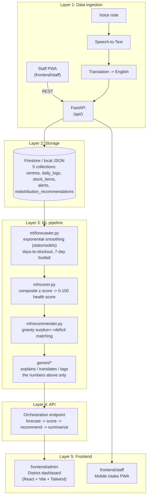

# SwasthyaSetu

AI-driven health centre and supply chain management for a district's PHCs/CHCs (Primary Health Centres / Community Health Centres).

## Problem statement

District health officers overseeing a network of PHCs and CHCs have no real-time visibility into three recurring failure modes:

- **Medicine stock-outs** that go unnoticed until a patient is turned away, because nobody is forecasting consumption against remaining stock.
- **Unmanaged footfall and bed pressure**: some centres are quietly overcrowded while nearby centres have spare capacity, with no district-level view to rebalance.
- **Unpredictable doctor attendance and stock imbalance across centres**, with no automatic way to flag an underperforming centre before it becomes a crisis, or to suggest which nearby centre could redistribute surplus medicine to cover a shortfall.

Meanwhile, the frontline staff who hold the data report on paper or ad-hoc phone calls, in a country where the reporting staff's working language is regional, not English, and typing on a phone is often slower than speaking.

**SwasthyaSetu** closes both gaps: a mobile-first staff app for daily intake (voice or text, regional-language-first) feeding a statistical ML pipeline that gives district officers early stock-out warnings, demand forecasts, redistribution recommendations, and automatic flagging of underperforming centres.

## Who it serves

```
PHC/CHC staff  --daily intake (voice/text)-->  District health officers  --redistribution & policy decisions-->  Patients
                                                       |
                                                       v
                                          MPs / district administration
                                          (oversight, budget, scale-up decisions)
```

- **PHC/CHC staff**: log daily stock, footfall, and attendance in under a minute; report incidents by voice, in their own language.
- **District health officers**: one dashboard showing every centre's health score, active alerts, and where to redistribute surplus medicine.
- **Patients**: the actual beneficiaries: fewer stock-outs, less overcrowding, more predictable care.
- **District/state administration**: a scalable, low-cost model for oversight across many districts.

## Architecture



Real statistical ML (exponential smoothing, z-score scoring, greedy matching) does the forecasting, scoring, and redistribution math; Gemini only explains/translates/tags outputs that already exist. Deployable for free on Firebase Hosting (frontends) plus Render.com (backend), with Firestore and Cloud Run as the drop-in upgrade path once GCP credits are available.

### Orchestration flow, step by step

A single `POST /orchestration/run?language=<English|Hindi|Odia>` call (`api/routers/orchestration.py`) does the following, for every centre with daily logs, in one request:

1. **Forecast** (`ml/forecaster.py`): per-medicine days-to-stockout and a 7-day footfall forecast, from that centre's log history.
2. **Score** (`ml/scorer.py`): a 0-100 health score, benchmarked against every other centre's metrics for that run.
3. **Recommend** (`ml/recommender.py`): per medicine, greedily matches centres in deficit to the nearest centre with surplus.
4. **Flag and summarize** (`gemini/*`): stock forecasts under a medicine's reorder threshold and health scores under 30 become system-generated Alerts; Gemini drafts the human-readable message and a per-centre natural-language summary, in the requested language. If `GEMINI_API_KEY` is missing or the call fails, a templated fallback message is used instead so the response never fails because of the LLM layer.

Alerts and recommendations are keyed deterministically (for example `auto-{centre_id}-stockout-{medicine_id}`), so re-running orchestration updates existing entries instead of creating duplicates.

### Incident intake flow

`POST /incidents/voice` and `POST /incidents/text` (`api/routers/incidents.py`) turn a staff report into a tagged Alert:

1. Voice path only: audio bytes go through `SpeechService.transcribe()`, producing a transcript in the original language.
2. The transcript is translated to English via `SpeechService.translate_to_english()`.
3. `gemini/incident_tagger.py` extracts a structured category, severity, mentioned medicine names, and an English summary from the translated text, this is the one Gemini call that reads raw free text, since no statistical model exists for that.
4. The original-language transcript, its translation, and the tags are all stored on the resulting Alert, so staff-facing displays can still show the original wording.

## Gemini separation (important)

`gemini/` only ever receives numbers already computed by `ml/`: a health score, a list of `days_to_stockout`, a footfall total, an already-decided alert category/severity. It drafts the natural-language summary/alert text around those numbers, or extracts structured tags from a staff incident note (the one place it reads raw text, since there's no statistical model for free text). **It never decides a score or a forecast.** This is enforced by the function signatures in `gemini/summarizer.py`, `gemini/alert_drafter.py`, `gemini/incident_tagger.py`; see `gemini/tests/` for tests that assert on the exact prompt contents.

If `GEMINI_API_KEY` isn't set, every Gemini call falls back to a templated message (orchestration) or an `"other"`/`"medium"` tag (incident intake); the numeric pipeline and the rest of the app keep working.

## Data model

Five collections, defined once in `api/models/schemas.py` (the single source of truth shared by the API layer and the synthetic data generator/seeder):

| Collection | Key fields | Notes |
|---|---|---|
| `centres` | `centre_id`, `name`, `type` (`PHC`/`CHC`), `district_zone`, `lat`, `lng`, `bed_capacity` | Static roster |
| `stock_items` | `medicine_id`, `name`, `unit`, `reorder_threshold_days` | Static medicine catalog; `reorder_threshold_days` drives both the scorer and the recommender |
| `daily_logs` | `log_id`, `centre_id`, `log_date`, `stock_snapshot` (per-medicine `units_in_stock` + `avg_daily_consumption`), `footfall_count`, `bed_occupancy_pct`, `doctor_attendance`, `test_kits_available` | One per centre per day; the raw input to the entire ML pipeline |
| `alerts` | `alert_id`, `centre_id`, `created_at`, `category`, `severity`, `status` (`open`/`resolved`), `message`, `source_metric` | Created either by orchestration (stockout/underperforming) or by incident intake (staff-reported) |
| `redistribution_recommendations` | `recommendation_id`, `medicine_id`, `from_centre_id`, `to_centre_id`, `suggested_units`, `urgency_score`, `distance_km`, `status` (`pending`/`approved`/`rejected`), `created_at` | Generated by `ml/recommender.py`, acted on from the admin dashboard |

Both `api/db/local_repository.py` (JSON file) and `api/db/firestore_repository.py` (real Firestore) implement the same `Repository` interface (`api/db/repository.py`), selected at runtime by `DB_BACKEND`, so nothing above the repository layer ever imports a Firestore client directly.

## ML pipeline in detail

All three modules in `ml/` are pure functions, no network calls, no Firestore, no Gemini, and are unit tested in `ml/tests/` in isolation from the rest of the stack.

| Module | What it computes | Method |
|---|---|---|
| `forecaster.py` | Per-medicine days-to-stockout, 7-day-ahead footfall | Simple exponential smoothing on the consumption series for stockout; Holt-Winters with weekly seasonality (falls back to simple smoothing under 21 days of history) for footfall |
| `scorer.py` | 0-100 health score per centre | Averages 4 metrics (stock availability, doctor attendance rate, bed availability, test-kit availability) over a 14-day window, computes a z-score for each metric relative to that day's district peer average, then maps the composite z-score through the normal CDF to a 0-100 score |
| `recommender.py` | Which centre should send how much of which medicine, to where | Greedy matching: centres below their reorder threshold are served most-urgent-first, matched to the nearest centre with stock above 2x its own threshold (haversine distance), transferring the minimum of what's needed and what's spare |

This is real statistics, not an LLM guessing a number: every score and forecast is reproducible and auditable from the underlying daily logs.

## Testing

30 tests across three layers, run with `pytest` from the repo root:

| Location | Covers |
|---|---|
| `ml/tests/test_forecaster.py`, `test_scorer.py`, `test_recommender.py` | Pure-function correctness of the forecaster, scorer, and recommender, with no mocking needed since none of them touch the network |
| `gemini/tests/test_summarizer.py`, `test_alert_drafter.py`, `test_incident_tagger.py` | Prompt-contract tests against a fake Gemini client, asserting the prompt only contains precomputed numbers (never raw daily logs) and that the fallback path activates when the client raises |
| `api/tests/test_orchestration_router.py`, `test_incidents_router.py`, `test_mock_speech_service.py` | End-to-end router behavior (forecast through to stored alerts/recommendations) and the mock speech/translation service used for local development |

## Repo structure

```
api/            FastAPI app: routers (CRUD + orchestration), db/ (Firestore or
                local-JSON repository, swappable via DB_BACKEND), services/
                (speech, swappable via USE_REAL_SPEECH_APIS), models/
                (Pydantic schemas, the 5-collection contract)
ml/             forecaster.py, scorer.py, recommender.py: pure functions, unit
                tested in ml/tests/, no Firestore/Gemini imports
gemini/         client.py + summarizer.py + alert_drafter.py + incident_tagger.py
data/seed/      constants.py (fictional Raighar District), generate_synthetic_data.py
                (90 days x 15 centres, seeded/reproducible), seed.py (loads it
                into whichever DB_BACKEND is active)
frontend/admin/ District dashboard: map, alerts feed, redistribution panel,
                per-centre drill-down with trend charts, English/Hindi/Odia toggle
frontend/staff/ Mobile intake PWA: onboarding, daily log form, voice/text incident report
render.yaml     Render.com Blueprint for the backend (see "Deploying" below)
firebase.json   Firebase Hosting config (admin + staff as separate hosting targets)
```

A good reading order for this repo: start at `ml/` (the actual algorithms, fully isolated and tested), then `gemini/` (to see the LLM boundary enforced in code, not just in docs), then `api/routers/orchestration.py` (how they're wired together).

### Frontend structure

`frontend/admin/src/`: `pages/Dashboard.tsx` (district overview), `pages/CentreDetail.tsx` (per-centre drill-down), `components/CentreMap.tsx`, `components/AlertsFeed.tsx`, `components/RedistributionPanel.tsx`, `components/LanguageToggle.tsx`, `i18n/` (English/Hindi/Odia translations and language context), `context/DistrictDataContext.tsx` (shared orchestration payload).

`frontend/staff/src/`: `pages/Onboarding.tsx`, `pages/Home.tsx`, `pages/DailyLogForm.tsx`, `pages/IncidentReport.tsx`, `components/VoiceButton.tsx`, `components/Stepper.tsx`, `components/ToggleYesNo.tsx`.

## Local setup

### Backend

Requires Python 3.12+ (3.13/3.14 also work, but some scientific-package wheels lag new Python releases; if `pip install` tries to compile from source, use 3.12).

```bash
python -m venv .venv
.venv\Scripts\activate          # Windows
# source .venv/bin/activate     # macOS/Linux
pip install -r requirements.txt
cp .env.example .env            # defaults to DB_BACKEND=local, no GCP needed yet
```

Generate the synthetic district (15 PHCs/CHCs, 90 days of logs) and seed the local store:

```bash
python -m data.seed.generate_synthetic_data
python -m data.seed.seed
```

Run the API:

```bash
uvicorn api.main:app --reload --port 8000
```

Run the tests (ML pure-function tests, Gemini prompt-contract tests with a fake client, API/router tests):

```bash
pytest
```

### Frontend

Each app is independent:

```bash
cd frontend/admin && npm install && npm run dev   # http://localhost:5173
cd frontend/staff && npm install && npm run dev    # http://localhost:5174
```

Both dev servers proxy `/api` to `http://127.0.0.1:8000` (see each `vite.config.ts`); no env vars needed locally.

## Environment variables

| Variable | Where | Default | Notes |
|---|---|---|---|
| `DB_BACKEND` | backend `.env` | `local` | `local` = JSON file, no GCP; `firestore` = real GCP Firestore |
| `GOOGLE_CLOUD_PROJECT` | backend `.env` | - | required when `DB_BACKEND=firestore` |
| `GOOGLE_APPLICATION_CREDENTIALS` | backend `.env` | - | optional; ADC via `gcloud auth application-default login` (local dev) or a service-account JSON (deployed backend), see "Switching to Firestore" |
| `GEMINI_API_KEY` | backend `.env` | - | from Google AI Studio; without it, Gemini calls fall back gracefully |
| `GEMINI_MODEL` | backend `.env` | `gemini-2.0-flash` | |
| `USE_REAL_SPEECH_APIS` | backend `.env` | `false` | `true` requires Speech-to-Text + Translation enabled on the project |
| `CORS_ALLOW_ORIGINS` | backend `.env` | `["http://localhost:5173","http://localhost:5174"]` | JSON array of exact origins; add your Firebase Hosting URLs for production |
| `VITE_API_BASE_URL` | each `frontend/*/.env.production.local` | unset (dev proxy) | set for production builds to the Render backend URL |

## What's mocked vs. real

- **Storage**: `DB_BACKEND=local` (default) writes to `local_data/db.json` so the whole stack runs with zero GCP setup, and the same file is baked into the Docker image at build time (see `Dockerfile`), so the deployed Render backend works with zero database setup too. Flip to `firestore` with no code changes once you've done the Firestore setup below.
- **Speech-to-Text / Translation**: `MockSpeechService` (default) decodes uploaded bytes as UTF-8 text and translates a handful of canned Hindi/Odia PHC phrases, so the voice flow is fully demoable without credentials. `RealSpeechService` (same interface, `USE_REAL_SPEECH_APIS=true`) calls actual Cloud Speech-to-Text + Translation; no frontend changes needed to switch.
- **Gemini**: real calls if `GEMINI_API_KEY` is set; templated fallbacks otherwise. The numeric ML pipeline never depends on Gemini being configured.

## Switching to Firestore

`DB_BACKEND` is the only thing that changes: `api/db/repository.py` picks the implementation at runtime, and both implementations satisfy the same interface, so no calling code changes.

1. Create a Firestore database (Native mode) on the free Spark plan, via the [Firebase console](https://console.firebase.google.com) (no billing card required on Spark), project `swasthyasetu-hackathon`.
2. Auth, pick one:
   - **Local dev**: `gcloud auth application-default login`, leave `GOOGLE_APPLICATION_CREDENTIALS` unset.
   - **Deployed backend (Render)**: download a service-account JSON (GCP Console, IAM & Admin, Service Accounts, a key with the "Cloud Datastore User" role), upload it as a Render **Secret File**, and set `GOOGLE_APPLICATION_CREDENTIALS` to its mounted path.
3. Set `DB_BACKEND=firestore` and `GOOGLE_CLOUD_PROJECT=swasthyasetu-hackathon`.
4. Load the same synthetic dataset into Firestore (this is the migration script, it's backend-agnostic, so it just writes to whichever backend is active):
   ```bash
   python -m data.seed.generate_synthetic_data
   DB_BACKEND=firestore GOOGLE_CLOUD_PROJECT=swasthyasetu-hackathon python -m data.seed.seed
   ```
5. Confirm it worked: `GET /health` returns `document_counts` per collection, sourced live from whichever backend is active.

## Enabling real Speech-to-Text / Translation

Mocked by default (`USE_REAL_SPEECH_APIS=false`) so the voice flow is demoable with zero GCP setup. Once GCP credits/billing are available:

```bash
gcloud services enable speech.googleapis.com translate.googleapis.com --project swasthyasetu-hackathon
```

Set `USE_REAL_SPEECH_APIS=true` (and Firestore-style auth as above, since the real Speech/Translate clients need the same credentials): `api/services/real_speech_service.py` implements the same interface as the mock, so no frontend or router changes are needed.

## Deploying (free tier: Firebase Hosting + Render.com)

### 1. Backend to Render.com

1. Create a free account at [render.com](https://render.com) (GitHub sign-in is simplest).
2. **New, Blueprint**, connect this GitHub repo: Render reads `render.yaml` from the repo root and provisions the `swasthyasetu-api` web service automatically.
3. Render will prompt for the two secrets marked `sync: false` in `render.yaml`: `GEMINI_API_KEY` (from [aistudio.google.com/apikey](https://aistudio.google.com/apikey)) and `GOOGLE_APPLICATION_CREDENTIALS` (leave blank while `DB_BACKEND=local`).
4. Deploy. Render builds the Dockerfile (which bakes in the seeded demo dataset) and starts the service; note the deployed URL, for example `https://swasthyasetu-api.onrender.com`.
5. Confirm it's healthy:
   ```bash
   curl https://swasthyasetu-api.onrender.com/health
   ```
   Expect `{"status":"ok","db_backend":"local","document_counts":{...}}`.

Note: Render's free tier spins the service down after 15 minutes of inactivity and takes roughly 30-60s to cold-start on the next request; worth knowing before a live demo (hit `/health` a minute before presenting).

### 2. Frontends to Firebase Hosting

```bash
npm install -g firebase-tools
firebase login
```

Firebase site IDs must be globally unique. If `swasthyasetu-admin` / `swasthyasetu-staff` are taken, pick your own and update `.firebaserc` (`targets.swasthyasetu-hackathon.hosting`) to match.

```bash
firebase hosting:sites:create swasthyasetu-admin
firebase hosting:sites:create swasthyasetu-staff
```

Point each frontend at the deployed Render URL and build:

```bash
echo "VITE_API_BASE_URL=https://swasthyasetu-api.onrender.com" > frontend/admin/.env.production.local
echo "VITE_API_BASE_URL=https://swasthyasetu-api.onrender.com" > frontend/staff/.env.production.local

(cd frontend/admin && npm run build)
(cd frontend/staff && npm run build)

firebase deploy --only hosting
```

Then go back to Render and set `CORS_ALLOW_ORIGINS` on the `swasthyasetu-api` service to the exact deployed URLs (see `render.yaml` for the expected format), so the browser apps are allowed to call the API.

Deployed URLs will look like:
- Admin dashboard: `https://swasthyasetu-admin.web.app`
- Staff intake app: `https://swasthyasetu-staff.web.app`

(or `https://<your-site-id>.web.app` / `.firebaseapp.com` if you picked different site IDs.)

### Scaling to full Google Cloud

Once GCP credits are available, the same Dockerfile deploys to Cloud Run with `DB_BACKEND=firestore` and real Speech-to-Text/Translation; no application code changes, only environment variables and infra config, since every backend swap point (`db/repository.py`, `services/speech_service.py`) is an interface, not a hardcoded call.

## Tech stack

| Layer | Technology | Why |
|---|---|---|
| Backend framework | FastAPI + Pydantic | Async-friendly, automatic OpenAPI docs, and Pydantic gives one schema definition shared by validation, serialization, and the API contract |
| ML | statsmodels (Holt-Winters / exponential smoothing), scipy, numpy, pandas | Battle-tested statistical forecasting instead of hand-rolled math or an LLM guessing numbers |
| LLM layer | Gemini API (`google-genai`, AI Studio key) | Free tier, no billing required, and a clean separation from the numeric pipeline (see "Gemini separation") |
| Database | Firestore (Spark plan) / local JSON | Firestore free tier needs no billing card; local JSON keeps local dev and CI fast with no GCP dependency |
| Speech/Translation | Cloud Speech-to-Text + Translation (mockable) | Regional-language voice intake for staff who may not be comfortable typing in English |
| Frontend | React 19 + Vite + TypeScript | Fast dev server, small bundles, strong typing across two independent apps sharing no runtime code |
| Styling | Tailwind CSS 4 | Rapid UI iteration without a heavier component library dependency |
| Charts | Recharts | Trend charts for per-centre drill-down (stock/footfall over time) |
| Hosting (frontend) | Firebase Hosting (Spark/free plan) | Free, global CDN, multi-site support (admin + staff as separate targets) out of the box |
| Hosting (backend) | Render.com (free tier) | Free Docker hosting with zero GCP billing setup, using the same Dockerfile Cloud Run would use later |
| Containerization | Docker | The identical image runs on Render now and Cloud Run later, with no re-packaging needed to upgrade |

## Key API endpoints

- `GET/POST /centres`, `/stock-items`, `/daily-logs`, `/alerts`, `/recommendations`: CRUD over the 5 collections.
- `GET /centres/{centre_id}`: single centre lookup, 404 if not found.
- `GET /daily-logs?centre_id=...`: filter logs by centre.
- `GET /alerts?status=open|resolved`, `GET /recommendations?status=pending|approved|rejected`: filter by status.
- `PATCH /alerts/{id}/resolve`: mark an alert resolved.
- `PATCH /recommendations/{id}/approve` / `/reject`: act on a redistribution suggestion.
- `POST /incidents/text`: submit a typed incident report (translate, tag, store as Alert).
- `POST /incidents/voice`: submit a voice incident report (transcribe, translate, tag, store as Alert).
- `POST /orchestration/run?language=English|Hindi|Odia`: runs forecast, score, recommend, and Gemini summarize/draft for the whole district in one call; this is what the admin dashboard calls on load and on "Refresh Analysis".
- `GET /health`: backend and database connectivity check, returns per-collection document counts.

## Screenshots

_Add screenshots here:_
- Admin dashboard: district map and health scores
- Admin dashboard: alerts feed
- Admin dashboard: redistribution panel
- Admin dashboard: per-centre drill-down with trend chart
- Staff app: daily log form
- Staff app: voice incident report flow
